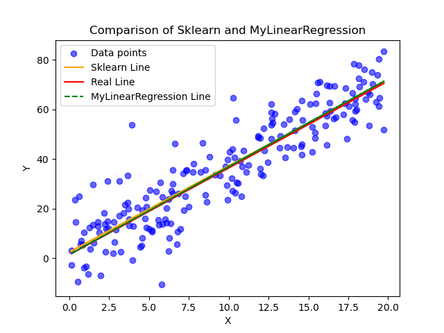

# In this repo I attempt to implement every basic ML model using only numpy. 

# 1) Linear-Regression-with-Numpy

Overview:
1) Initilaize graph using np.uniform() and np.normal() for noise, then scaling them by some m (slope) and b (intercept) to make the data.
2) MyLinearRegression class first fits on the data, calls gradient descent algorithm which computes the gradient of the MSE (vector of the partial derivative of the MSE function with respect to m and b) and decrements current m and b values by the gradient scaled by alpha (the learning rate). Stops when max iter is reached or when error is lower than threshold.

Here is this implementation compared with sklearn.

